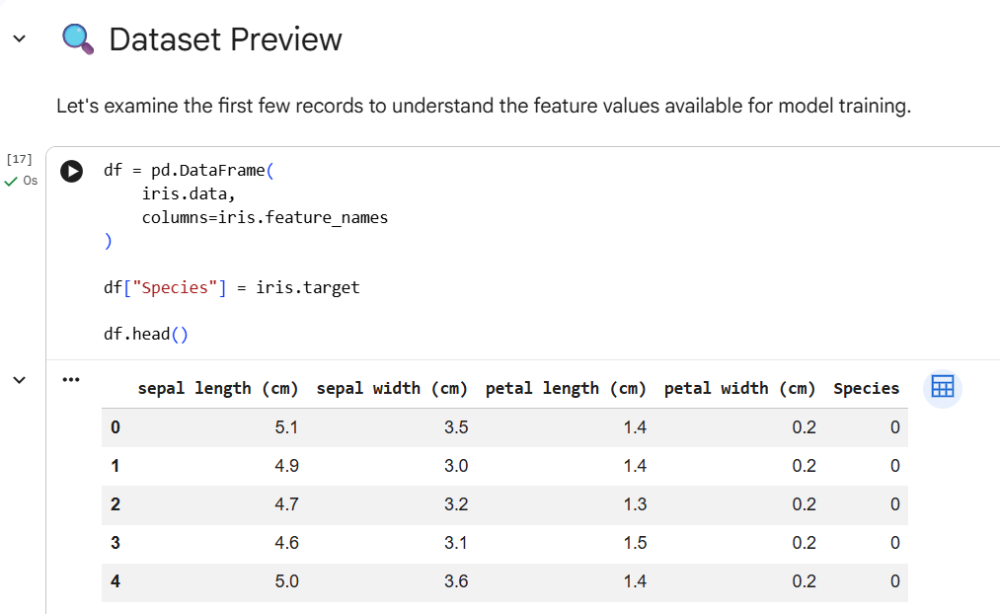
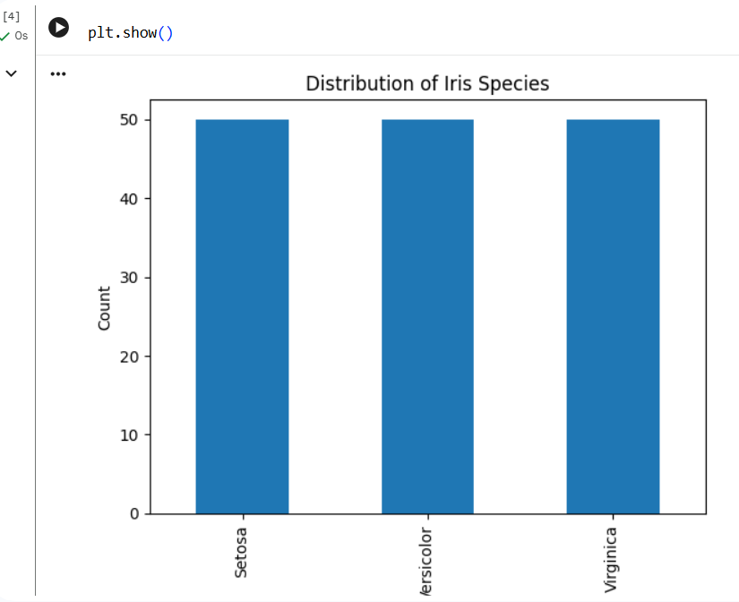
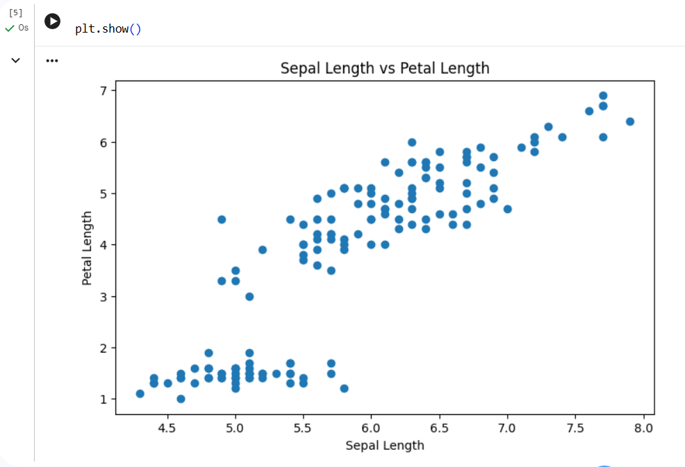
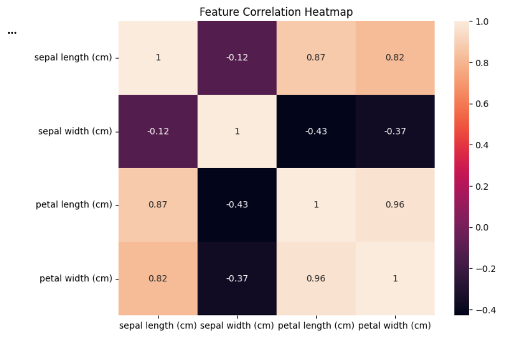
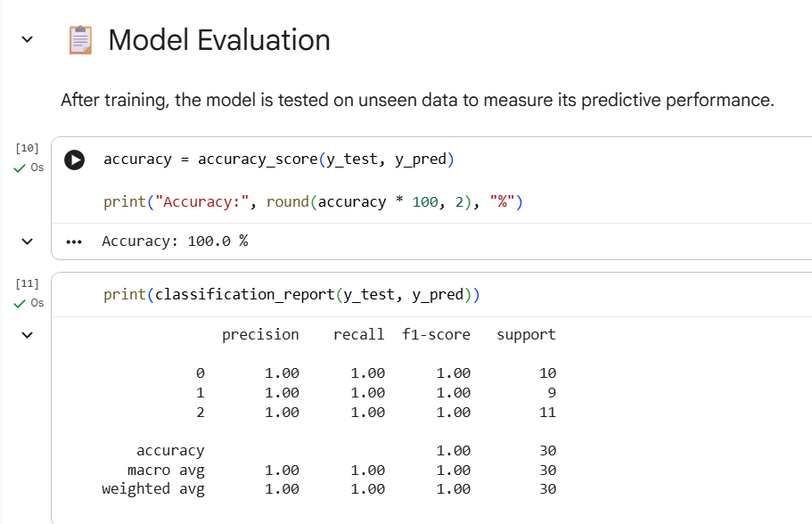
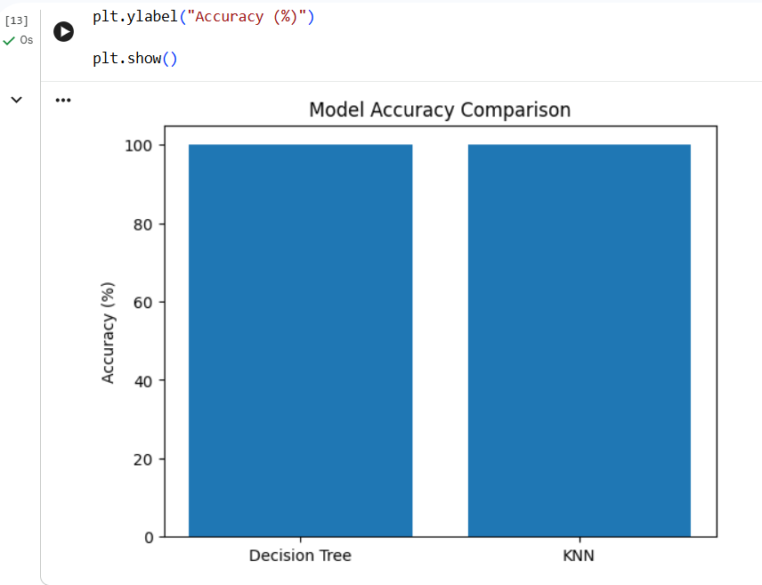
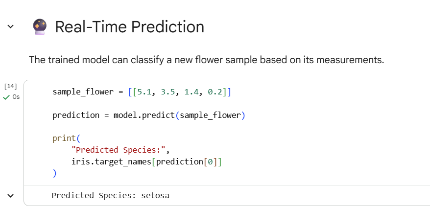

# 🌸 Data Classification Using AI

A Machine Learning classification project developed as part of the **DecodeLabs Artificial Intelligence Internship Program**. This project demonstrates the complete supervised learning workflow, including data exploration, visualization, model training, evaluation, and prediction using the famous Iris Flower Dataset.

---

## 📌 Project Overview

The objective of this project is to build an AI-powered classification model capable of predicting the species of an Iris flower based on its physical characteristics.

The project follows the standard Machine Learning pipeline:

* Data Loading
* Data Exploration
* Data Visualization
* Data Preprocessing
* Model Training
* Model Evaluation
* Performance Comparison
* Prediction on New Data

---

## 🎯 Objectives

* Understand the fundamentals of supervised learning
* Explore and analyze a real-world dataset
* Train classification models using Scikit-Learn
* Evaluate model performance using accuracy metrics
* Compare multiple machine learning algorithms
* Predict flower species from unseen data

---

## 📂 Dataset Information

The project uses the Iris Dataset, one of the most popular datasets in Machine Learning.

### Features

| Feature      | Description                    |
| ------------ | ------------------------------ |
| Sepal Length | Length of sepal in centimeters |
| Sepal Width  | Width of sepal in centimeters  |
| Petal Length | Length of petal in centimeters |
| Petal Width  | Width of petal in centimeters  |

### Target Classes

* Setosa
* Versicolor
* Virginica

### Dataset Statistics

* Total Samples: 150
* Features: 4
* Classes: 3

---

## 🛠️ Technologies Used

* Python
* Google Colab
* Pandas
* NumPy
* Matplotlib
* Seaborn
* Scikit-Learn

---

## 📊 Data Visualization

Several visualizations were created to better understand the dataset:

### Species Distribution

Displays the number of samples available for each flower species.

### Feature Relationship Analysis

Scatter plots were used to observe relationships between different flower measurements.

### Correlation Heatmap

A heatmap was generated to identify correlations among the dataset features.

---

## 🤖 Machine Learning Models

### Decision Tree Classifier

A supervised learning algorithm that creates decision rules based on feature values.

### K-Nearest Neighbors (KNN)

A classification algorithm that predicts classes based on the nearest data points.

---

## 📈 Model Evaluation

The dataset was divided into:

* Training Data: 80%
* Testing Data: 20%

Evaluation Metrics:

* Accuracy Score
* Precision
* Recall
* F1-Score
* Classification Report

Both models achieved excellent classification performance on the testing dataset.

---

## 🔮 Prediction Example

The trained model can classify a new flower species using measurements provided by the user.

Example Input:

Sepal Length = 5.1 cm

Sepal Width = 3.5 cm

Petal Length = 1.4 cm

Petal Width = 0.2 cm

Predicted Output:

Setosa

---

## 📸 Project Screenshots

### Dataset Preview

### Species Distribution Graph

### Scatter Plot Analysis

### Correlation Heatmap

### Model Evaluation output

### Model Accuracy Comparison

### Prediction Result

---

## 🚀 Learning Outcomes

Through this project, I gained practical experience in:

* Data Analysis
* Data Visualization
* Supervised Machine Learning
* Classification Algorithms
* Model Evaluation Techniques
* Predictive Analytics
* AI Project Development

---

## 🔮 Future Improvements

* Implement Random Forest Classifier
* Add Support Vector Machine (SVM)
* Develop a Web-Based Prediction Interface
* Deploy the Model Using Streamlit
* Test Additional Real-World Datasets

---

## 👩‍💻 Author

**Rimsha Shehzadi**

Software Engineer | Machine Learning Enthusiast

DecodeLabs Artificial Intelligence Intern (2026)

---

## ⭐ Acknowledgement

This project was completed as part of the DecodeLabs Artificial Intelligence Internship Program to strengthen practical understanding of supervised machine learning and data classification techniques.
